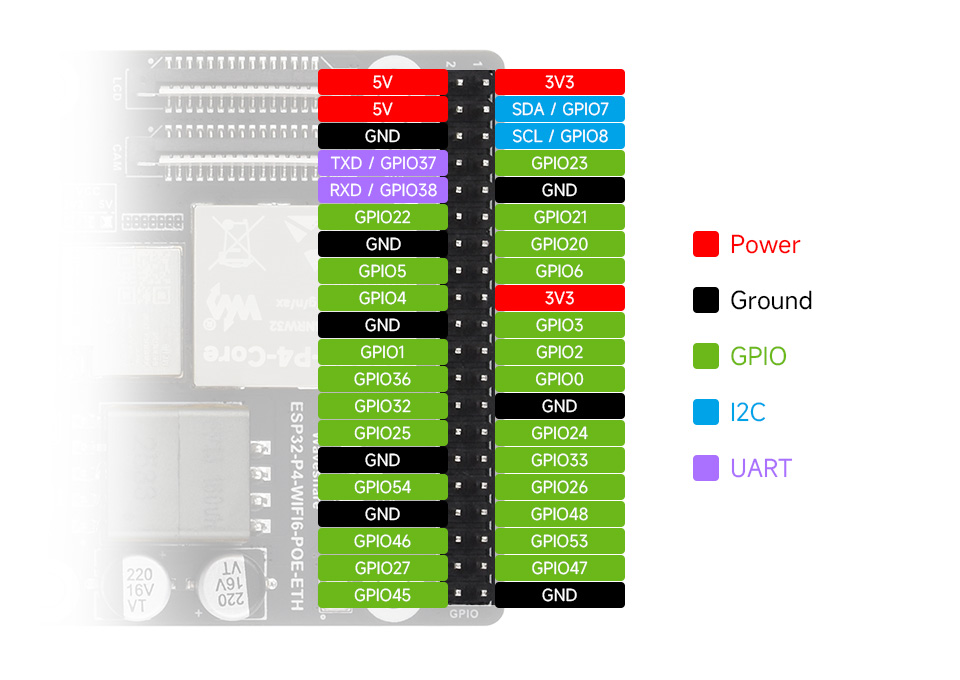
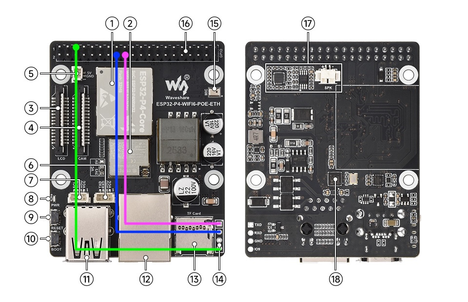
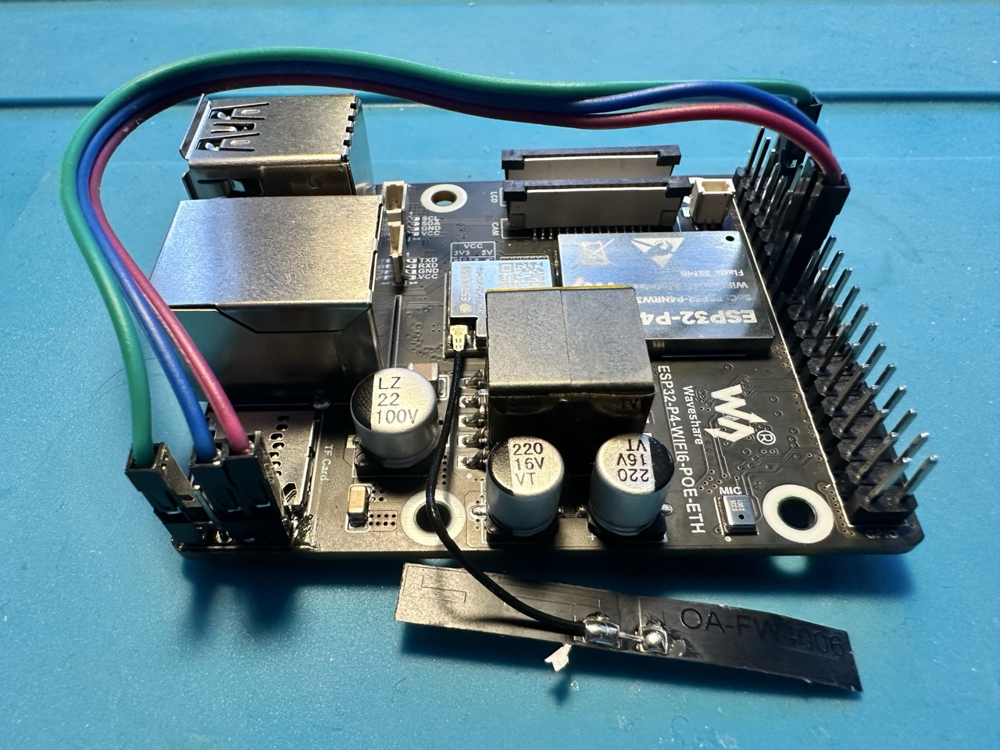

```
                                              _   _                        _       _                   _                           _
  ___  ___ _ __         ___  _ __   ___ _ __ | |_| |__  _ __ ___  __ _  __| |     | |__   ___  _ __ __| | ___ _ __ _ __ ___  _   _| |_ ___ _ __
 / _ \/ __| '_ \ _____ / _ \| '_ \ / _ \ '_ \| __| '_ \| '__/ _ \/ _` |/ _` |_____| '_ \ / _ \| '__/ _` |/ _ \ '__| '__/ _ \| | | | __/ _ \ '__|
|  __/\__ \ |_) |_____| (_) | |_) |  __/ | | | |_| | | | | |  __/ (_| | (_| |_____| |_) | (_) | | | (_| |  __/ |  | | | (_) | |_| | ||  __/ |
 \___||___/ .__/       \___/| .__/ \___|_| |_|\__|_| |_|_|  \___|\__,_|\__,_|     |_.__/ \___/|_|  \__,_|\___|_|  |_|  \___/ \__,_|\__\___|_|
          |_|               |_|
```

# OpenThread Border Router for Waveshare ESP32-P4-WIFI6-POE-ETH

Instructions for configuring and compiling esp-idf and esp-thread-br for a [Waveshare ESP32-P4-WIFI6-POE-ETH](https://www.waveshare.com/esp32-p4-wifi6-poe-eth.htm). The board will be connected to the LAN via ethernet and acts as a router between the LAN and devices on the Thread radio network.

## Hardware configuration

To enable the on-board ESP32-C6 as a radio co-processor (RCP) for the ESP32-P4 you must connect three GPIO pins to three pins on the ESP32-C6 UART pads ([header H7 in the schematic](https://files.waveshare.com/wiki/ESP32-P4-WIFI6-POE-ETH/ESP32-P4-WIFI6-POE-ETH-Schematic.pdf)). Waveshare has hardwired the P4 and C6 together with the "SDIO interface protocol", which according to all my digging (and many hours of frustration) is not compatible with the esp RCP connection requirements. Luckily, we can actually connect the C6 to the P4 as an RCP as Waveshare has made the required connections available to us via headers.

| ESP32-P4   | ESP32-C6          |
|------------|-------------------|
| GPIO8      | IO9 (Header H7 4) |
| GPIO5      | RX (Header H7 2)  |
| GPIO4      | TX (Header H7 1)  |
| GPIO54     | EN                |

For the ESP32-C6 'EN' pin, Waveshare has hardwired this to ESP32-P4's GPIO54 (once again, see the schematic).

I've created a configuration override for the above mapping in [`sdkconfig.custom`](./sdkconfig.custom).





## Software configuration

Espressif has provided a very nice, functional codebase for an OpenThread Border Router. Start at the [esp-thread-br](https://github.com/espressif/esp-thread-br) codebase, using a release tag (not main) and navigating to the basic_thread_border_router in the example directory.

The latest release is currently v1.3, so I followed the installation [instructions for that version](https://github.com/espressif/esp-thread-br/releases/tag/v1.3).

First up is getting esp-idf toolchain installed. I'm used to platformio and esphome's nice abstraction of these installation details, so getting down to the bare bones was a bit rough.
I followed these instructions: [https://docs.espressif.com/projects/esp-idf/en/v5.5.2/esp32p4/get-started/linux-macos-setup.html](https://docs.espressif.com/projects/esp-idf/en/v5.5.2/esp32p4/get-started/linux-macos-setup.html), summarized below.

```
# <root_dir> is this directory
cd <root_dir>

git clone -b v5.5.2 --recursive https://github.com/espressif/esp-idf.git
brew install cmake ninja dfu-util python3
cd esp-idf
./install.sh esp32p4
. ./export.sh

# the border router code requires a pre-built module from this codebase: `ot_rcp`
cd esp-idf/examples/openthread/ot_rcp
idf.py set-target esp32c6
idf.py build
```

Now we have the esp-idf toolchain available for use in our current shell (`. ./export.sh`). Let's continue now in the same shell (so we have `idf.py` in our path) with the border router code: [https://github.com/espressif/esp-thread-br/blob/main/examples/basic_thread_border_router/README_esp32p4.md](https://github.com/espressif/esp-thread-br/blob/main/examples/basic_thread_border_router/README_esp32p4.md).

```
cd <root_dir>
git clone -b v1.3 https://github.com/espressif/esp-thread-br.git
cd esp-thread-br/examples/basic_thread_border_router

# copy custom sdkconfig options to the directory
cp <root_dir>/sdkconfig.custom .

idf.py add-dependency "espressif/esp_wifi_remote"
idf.py add-dependency "espressif/esp_hosted"

idf.py -D "SDKCONFIG_DEFAULTS=sdkconfig.defaults;sdkconfig.defaults.esp32p4;sdkconfig.custom" set-target esp32p4
idf.py build

# transfer to the board and flash!
idf.py erase-flash flash

# monitor the logs (ctrl-t ctrl-x to exit)
idf.py monitor
```

## Configuration

You can access the OpenThread web interface at [http://esp-ot-br.local](http://esp-ot-br.local).


# References

- [esp-idf](https://github.com/espressif/esp-idf)
- [esp-thread-br](https://github.com/espressif/esp-thread-br)
- [esp32-p4-wifi6-poe-eth](https://www.waveshare.com/esp32-p4-wifi6-poe-eth.htm)
- [ESP32-P4-WIFI6-POE-ETH schematic](https://files.waveshare.com/wiki/ESP32-P4-WIFI6-POE-ETH/ESP32-P4-WIFI6-POE-ETH-Schematic.pdf)
- [ESP32-P4-WIFI6-POE-ETH schematic, offline](./assets/ESP32-P4-WIFI6-POE-ETH-Schematic.pdf)
